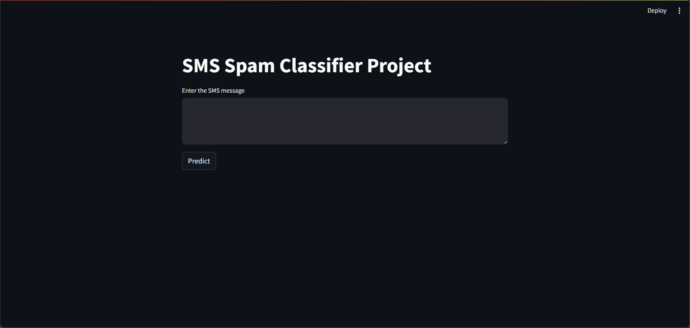

# SMS-Classifier-Project

This project is a text classification model to classify SMS as either spam or non-spam using data science techniques in Python.

## Table of Contents
* Dataset
* Technologies
* Website Interface
* Conclusion
* Note

## Dataset
The project used Dataset from Kaggle - https://www.kaggle.com/datasets/uciml/sms-spam-collection-dataset


## Technologies Used
* NLTK
* Sklearn, RNN & BERT for model building
* Streamlit 

## Website Interface
The website has a simple and intuitive interface that allows users to type texts and classify them. The user can type the SMS he recivies in a textbox in the webpage, the application shows the predicted result on wether the text is spam or not.



# Conclusion
This project successfully classified texts with an accuracy of around 97%. The use of machine learning models and NLTK for data cleaning and preparation allowed for effective text classification. The user interface also provided a seamless experience for users to type and classify texts.
To launch the project, navigate cd "c:\Pranay\Bharat Intern\SpamFilter-main\Server" and type `streamlit app.py` in the command prompt or terminal.

# Note
Make sure to install all necessary libraries.
You can install the required packages by running the following command:
```
pip install pandas numpy scikit-learn nltk matplotlib

pip install streamlit

```

